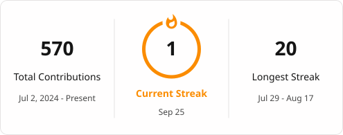

<!-- About Me 

# 💫 About Me:

  
😄 I’m a software engineer 🔭 Working on full stack applications 🌱 Currently learning DSA in C++ ⚡ I’m looking to collaborate on real world projects

-->

<!-- Stats -->
# 📊 GitHub Stats:

# 📊 GitHub Stats

  <picture>
    <source media="(prefers-color-scheme: dark)" srcset="./profile/stats-dark.svg">
    <source media="(prefers-color-scheme: light)" srcset="./profile/stats-light.svg">
    
  </picture>
  <picture>
    <source media="(prefers-color-scheme: dark)" srcset="./profile/top-langs-dark.svg">
    <source media="(prefers-color-scheme: light)" srcset="./profile/top-langs-light.svg">
    
  </picture>

  <picture>
    <source media="(prefers-color-scheme: dark)" srcset="./profile/streak-dark.svg">
    <source media="(prefers-color-scheme: light)" srcset="./profile/streak-light.svg">
    
  </picture>

---

# 🐍 Contribution Activity

  <picture>
    <source media="(prefers-color-scheme: dark)" srcset="./profile/github-contribution-grid-snake-dark.svg">
    <source media="(prefers-color-scheme: light)" srcset="./profile/github-contribution-grid-snake.svg">
    
  </picture>

---

<!-- Tech Stack -->
# 💻 Tech Stack:

   
  

<!-- Socials -->
# 🌐 Connect With Me:

  
  
  
  

  <b>Let's build something interesting.</b>

<!-- Snake -->

  

